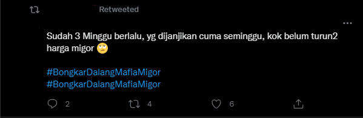

# Buzzer Checker

## Deskripsi Task
Setelah kalian banyak mempelajari hal-hal yang erat dengan teori di perkuliahan, sekarang adalah saatnya kalian membuat aplikasi yang bersifat applicable dalam kehidupan sehari-hari. *Problem* yang ingin aku usung kali ini adalah susahnya menentukan sebuah akun di Twitter merupakan akun *real* atau akun *buzzer*. Seperti yang kita tahu, akun *buzzer* merupakan akun yang menyuarakan hal yang sama (biasanya > 1 akun) sehingga dapat mempengaruhi *trend* yang terjadi di media sosial. Biasanya, akun *buzzer* digunakan ketika sekelompok orang ingin menyatakan suatu kepentingan di media sosial. Oleh karena itu untuk membedakan apakah suatu *trend* dibangun oleh keresahan orang atau hanya diramaikan oleh para *buzzer*, kita memerlukan suatu aplikasi yang dapat membedakan apakah sebuah akun merupakan *buzzer* atau *real*.

 
  <b>Fig 1.</b> Contoh tweet yang memiliki indikasi sebagai buzzer tweet
 

## Spesifikasi Wajib (2400 poin)
<ol>
  <li>Aplikasi berbasis <i>website</i> dengan pemisahan <i>frontend</i> dan <i>backend</i> yang jelas. <i>Frontend</i> tidak perlu mewah yang penting intuitif.</li>
  <li>Aplikasi akan memanfaatkan <a href=https://developer.twitter.com/en/docs/twitter-api>Twitter API</a>.</li>
  <li>Aplikasi dapat menerima masukan <i>username</i> seseorang dan mengembalikan probabilitas apakah orang tersebut merupakan <i>buzzer</i> atau tidak serta kata yang sering di-tweet oleh tersebut (jika mengimplementasikan dimensi vektor jumlah kemunculan suatu kata).</li>
  <li>Menghitung probabilitas mengikuti <i>baseline</i> seperti di bawah ini:</li>
  <ol>
    <li>Suatu akun diwakili sebuah vektor berdimensi tiga.</li>
    <li>Dengan masing-masing dimensi mewakili apa dibebaskan kepada kalian. Contoh dari penulis soal, tanggal dibuatnya sebuah akun, waktu rata-rata selang satu tweet dengan tweet yang lain (dibatasi 10 tweet terakhir, <b>configurable</b>), dan jumlah kemunculan suatu kata. (diambil yang terbesar dan dibatasi 10 tweet terakhir, <b>configurable</b>)</li>
    <li>Buat sebuah vektor berdimensi tiga sebagai acuan, <b>configurable</b>. Contoh dari penulis soal, tanggal 15 Juni 2022, 30 menit, dan 10 buah.</li>
    <li>Selanjutnya, gunakan dot product dari kedua vektor tersebut untuk mendapatkan probabilitasnya. (materi sistem temu balik pada Algeo, cosine similarity)</li>
   </ol>
  <li>Semua ketentuan yang ditulis "configurable" dapat diatur nilainya melalui .env file. Jangan lupa disediakan .env.example sebagai contoh. (karena biasanya .env file tidak dipush ke dalam <i>repository</i>)</li>
  <li><i>Backend</i> dari aplikasi diwajibkan untuk di-deploy.</li>
</ol>

## Spesifikasi Bonus (600 poin)
<ul>
  <li>Menambahkan atau merubah dimensi vektor dengan alasan dan pertimbangan yang valid. (150 poin)</li>
  <li>Usung 1 ide tambahan (lebih juga boleh sich) agar algoritma pengecekkan menjadi lebih baik. (100 poin)</li>
  <li>Mengimplementasikan <i>clean architecture</i>. Contoh dapat dilihat dalam folder example. <a href="https://betterprogramming.pub/the-clean-architecture-beginners-guide-e4b7058c1165">Referensi</a> (100 poin)</li>
  <li>Mendapatkan 1 contributor (bukan teman) dalam pengembangannya. Khusus bonus ini poinnya bisa didapatkan saat demo maupun post-demo. (250 poin)</li>
</ul>

## Tujuan Task
<ol>
  <li>Membuat aplikasi yang usable.</li>
  <li>Mengenalkan membaca dokumentasi API.</li>
  <li>Mengenalkan <i>clean architecture</i>.</li>
  <li>Mengenalkan bagaimana membangun dan mengembangkan <i>open-source project</i>.</li>
</ol>

## Saran Pengerjaan
<ul>
  <li>API Key Twitter bersifat rahasia sehingga sangat disarankan untuk kalian simpan dalam .env tidak di-<i>hard-code</i>.</li>
  <li>Mulailah dari membangun <i>backend</i>. Identifikasi <i>endpoint</i> apa saja yang kalian butuhkan dari spesifikasi di atas (cuma satu doang sih kalo dipikirpikir wkawkak). Lalu <i>service</i> apa saja yang dibutuhkan dari masing-masing endpoint, apakah <i>service</i> tersebut membutuhkan <i>outbound service</i> dan seterusnya. </li>
  <li>Ketika menghitung kemunculan kata, hasilnya dapat kalian filter terlebih dahulu sehingga mengeliminasi kata-kata yang termasuk <em>common words</em>, misal "ketika", "kamu", "apa", dll. Contoh, 3 kata teratas yang paling banyak muncul adalah "partai", "kamu", dan "yang", maka kata yang lolos filter adalah "partai" dan dikembalikan ke tampilan user.</li>
</ul>

## Pengerjaan dan Pengumpulan
<ol>
  <li>Buat repository dan invite grevicoc ke dalam repository tersebut.</li>
  <li>Buatlah sebuah issue jika kalian memiliki pertanyaan.</li>
  <li>Pengumpulan dapat kalian lakukan dengan menghubungi mengisi <a href="https://docs.google.com/forms/d/e/1FAIpQLSes4nTI-vuL3IsVAqRPet2ongHGtm0hU5A8UCBnL012vmvwXA/viewform?usp=sf_link">form ini</a> dan menghubungi line: mtitop.</li>
  <li>Perlu diperhatikan batas commit terakhir adalah ketika kalian melakukan demo</li>
  <li>Good Luck Have Fun! It's not worth it if you are not having fun:D</li>
</ol>
